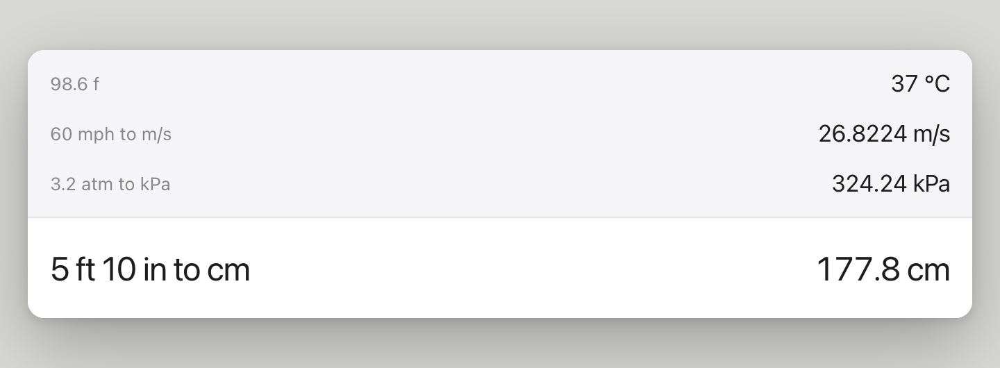
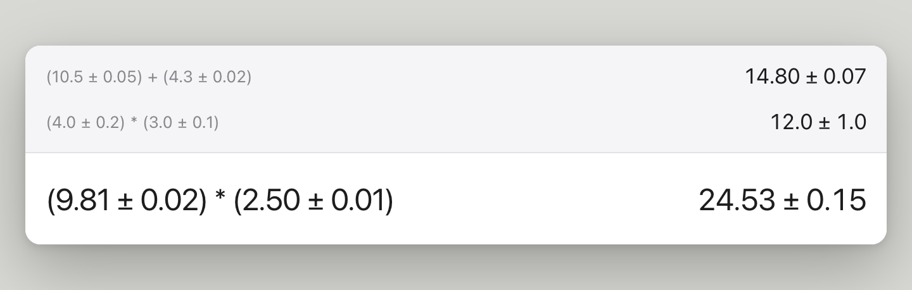
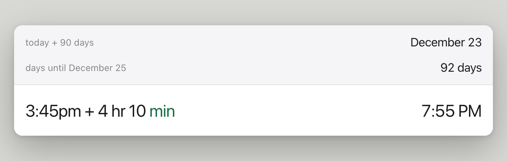
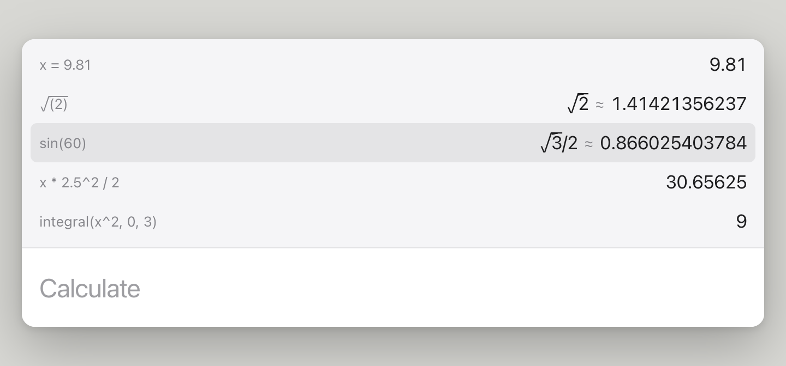
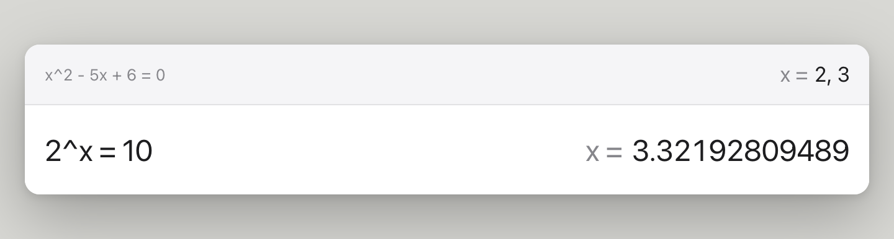
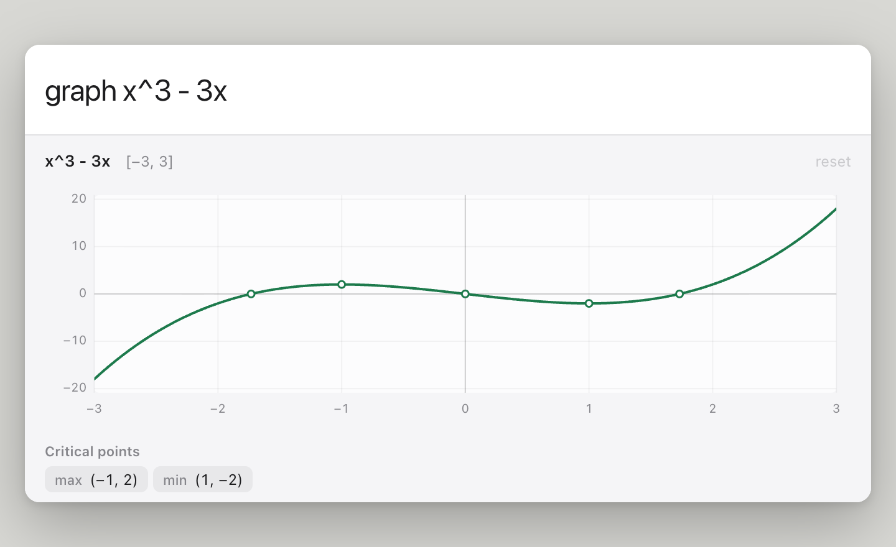
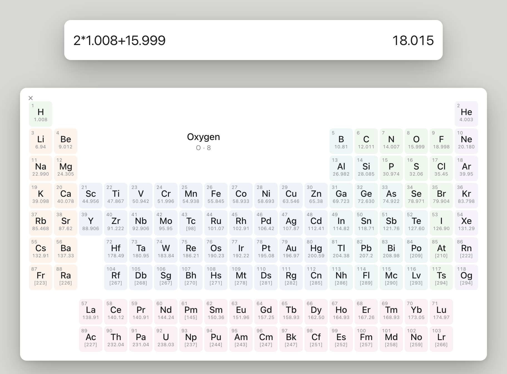

# Q(uick) Calc

A Spotlight-style scientific calculator for Mac. Press **Control + Option + Space** to calculate without leaving the app you’re in.

Type `sin(90)`, `72 f`, or `$10 for lunch + 15% tip` — the answer updates as you type.

## Preview

**Unit conversion.** Type a value with units, and add `to` for a specific target.

<picture>
  <source media="(prefers-color-scheme: dark)" srcset="docs/screenshots/units-dark.png">
  
</picture>

**Uncertainty.** Type `+/-` or `~` for ±, and the uncertainty carries through the calculation.

<picture>
  <source media="(prefers-color-scheme: dark)" srcset="docs/screenshots/uncertainty-dark.png">
  
</picture>

**Calendar and time math** (Mac app).

<picture>
  <source media="(prefers-color-scheme: dark)" srcset="docs/screenshots/calendar-dark.png">
  
</picture>

**History.** Enter saves a calculation, and the arrow keys walk back through the tape. Stored variables like `x` carry into later lines.

<picture>
  <source media="(prefers-color-scheme: dark)" srcset="docs/screenshots/history-dark.png">
  
</picture>

**Solving equations.** Type an equation with `=` to solve it.

<picture>
  <source media="(prefers-color-scheme: dark)" srcset="docs/screenshots/solve-dark.png">
  
</picture>

**Graphing.** `graph` plots a function and lists its critical points.

<picture>
  <source media="(prefers-color-scheme: dark)" srcset="docs/screenshots/graph-dark.png">
  
</picture>

**Periodic table.** Type `periodic table`, then click an element to insert its atomic mass.

<picture>
  <source media="(prefers-color-scheme: dark)" srcset="docs/screenshots/periodic-dark.png">
  
</picture>

## Installation

Install via Homebrew to get autoupdates (Preferred)

You need [Homebrew](https://brew.sh), an **Apple silicon Mac** (M1 or later), and **macOS 14** or later.

```bash
brew tap maxconine/qcalc https://github.com/maxconine/Q-Calc
brew trust --tap maxconine/qcalc
brew install --cask maxconine/qcalc/q-calc
zsh "$(brew --prefix)/Library/Taps/maxconine/homebrew-qcalc/macos/enable-autoupdate.sh"
```

Or:

```bash
/bin/zsh -c "$(curl -fsSL https://raw.githubusercontent.com/maxconine/Q-Calc/main/macos/install.sh)"
```

> [!NOTE]
> By using Q Calc, you acknowledge that it's not notarized.
>
> Homebrew automatically deletes the `com.apple.quarantine` attribute, so the app should work out of the box without a warning that “Apple cannot check Q Calc for malicious software.”
>
> Daily Homebrew upgrades for Q Calc are turned on at install. Opt out with `macos/install.sh --no-autoupdate`, or later with `brew autoupdate stop`.

The Q Calc icon appears in the menu bar. It does not show in the Dock.

If **Control + Option + Space** does nothing, macOS is often using that shortcut for Input Sources. Turn the shortcut off in **System Settings → Keyboard → Input Sources → Edit**.

To start Q Calc at login, add it under **System Settings → General → Login Items & Extensions**.

To upgrade immediately instead of waiting for the daily check:

```bash
brew update
brew upgrade --cask q-calc
```

## Using Q Calc

- **Control + Option + Space** shows the calculator. **Esc** or a click outside the window hides it. What you were typing is kept for a while (see **Keep unfinished** in the menu).
- Type as you would on a scientific calculator: `sin(90)`, `arcsin(0.5)`, `sin^-1(0.5)`, `sqrt(2)`, `2^8`, `5!`. `pi` becomes π as you type.
- **⌃D** switches between degrees and radians. **⌃F** toggles fraction results. **⌃C** clears history and resets stored variables and functions. **Answers → Rationalize denominators** controls whether exact answers like `5/sqrt(41)` are rewritten as `5sqrt(41)/41`.
- For trig and square roots, answers show a closed form next to the decimal when both exist (`sqrt(3)/2 ≈ 0.866025`). Click either side to copy (or, in history, to insert). Other expressions show the decimal. **⌘C** and `ans` follow **Answers → Exact** or **Approximate**.
- Unit conversions work too: `72 f`, `2 in to cm`.
- **Option + Up** and **Option + Down** step a metric answer's unit one prefix at a time, a factor of 1000 per press: `4700 ohm` becomes `4.7 kΩ`, and `2 L` becomes `2000 mL`, then `2000000 μL`.
- Store a variable with `x = 5`, then use it in later expressions (`x*2`). Define a function the same way: `f(x) = x^3`, then call it with `f(2)`.
- Graph with `graph x^3`, `graph f` (after defining `f`), or `graph f(x) = x^3`. A panel opens under the input with zoom and a list of critical points.
- Solve a system with `sys 2` through `sys 5`, then **Enter**. A smaller window opens under the calculator with one field per equation, and the answer updates as you type (`x + y = 5`, `x - y = 1`).
- Natural-language math works in the Mac app via SoulverCore: `$10 for lunch + 15% tip`, `40 is what % of 90`, `3:45pm + 4 hr 10 min`.
<!-- Apple Dictionary — uncomment to restore:
- Type a word such as `ingenious` to see its Apple Dictionary definition. Phrases work too: `define New York`, `definition of apple`, `what does pi mean`. Click the definition or press **⌘C** to copy it. **Enter** saves the word to history.
-->
- The answer updates as you type. Click it or press **⌘C** to copy. Type `ans` to insert it at the cursor.
- **Enter** saves the calculation to history. **Up arrow** or scroll the tape to see previous ones. Click a previous expression to insert it at the typing cursor. Click a previous answer — or either side of a dual answer — to insert that value (`cos(` then a previous `31` becomes `cos(31)`). Press **Enter** on a highlighted row to reuse it; **History** in the menu (or the History setting in the browser) chooses whether that brings in the original expression or just the answer.

The menu bar icon can show the calculator without the hotkey. Significant figures, exact vs approximate answers, whether to rationalize denominators, whether history inserts the expression or the answer, light or dark appearance, how long to keep unfinished input, and default units are set from the same menu.

## Development

The JavaScript engine can be tried in a browser. Natural-language math needs the Mac app.

```bash
npm install
npm run dev
```

Open http://localhost:5173/

```bash
npm test
```

Runs the engine suite, including the scientific checklist in `src/engine/scientific.test.ts`.

### Build the Mac app from source

Install [Xcode 26](https://developer.apple.com/xcode/) or later from the Mac App Store, open it once, then accept the license:

```bash
sudo xcode-select -s /Applications/Xcode.app/Contents/Developer
sudo xcodebuild -license accept
```

Xcode 26 is required because the Mac app links [SoulverCore](https://github.com/soulverteam/SoulverCore), which ships a Swift 6.2 binary. Node.js 20 or later is also required (`brew install node`).

```bash
npm install
npm run mac:install
```

That compiles Q Calc and copies **Q Calc.app** into `/Applications`. An older **Instant Solver.app** in Applications is removed.

```bash
npm run mac          # macos/dist/Q Calc.app
npm run mac:package  # macos/dist/Q-Calc-<version>.zip for Homebrew
```

If the clone is in **Documents** or **Desktop**, macOS may refuse to launch the repo build directly — use `npm run mac:install` or the Homebrew cask.

### Ship an update to field Macs

The current public release is **v2.0.1**. That is the GitHub Release, the zip linked from the download page, and the Homebrew cask.

To publish the next version:

1. Bump `"version"` in `package.json`.
2. Point the zip link in `docs/index.html` at that same version.
3. Commit, then tag and push that version:

```bash
git tag v$(node -p "require('./package.json').version")
git push origin main v$(node -p "require('./package.json').version")
```

The **Release** GitHub Action builds the zip, publishes it on GitHub Releases, and updates `Casks/q-calc.rb`. Macs that installed with Homebrew pick up that build on the next daily autoupdate, or immediately with `brew upgrade --cask q-calc`. You can also run **Release** from the Actions tab without pushing a tag.

## License

Q Calc is [MIT](LICENSE).

The Mac app embeds [SoulverCore](https://github.com/soulverteam/SoulverCore), a closed-source natural language math engine. SoulverCore may be used in personal and private projects. [Contact the authors](mailto:contact@soulver.app) before using it in a public or commercial project (they offer options, including a free license with attribution). `npm run mac` downloads the official xcframework at build time.
